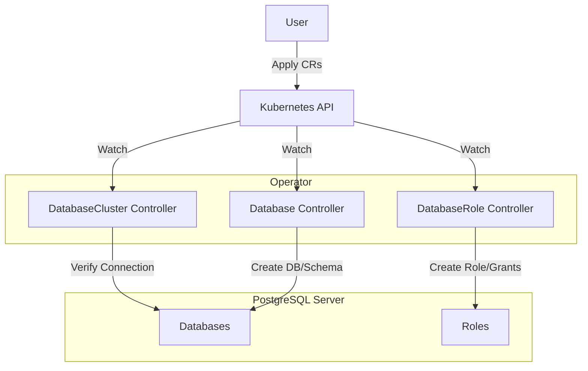

# Architecture

The Postgres Operator manages PostgreSQL resources within a Kubernetes cluster by connecting to an external (or in-cluster) PostgreSQL server. It uses the Operator pattern to reconcile the state of Custom Resources (CRs) with the state of the actual PostgreSQL database.

## Custom Resources

The operator defines three main Custom Resource Definitions (CRDs):

### 1. DatabaseCluster

Represents a connection to a generic PostgreSQL cluster (server). It does not provision the server itself but holds the connection details required for the operator to manage resources within it.

*   **Scope**: Cluster-wide (Cluster Scoped) usually, but in this implementation, it seems to be referenced by name. *Correction*: Looking at the code (`api/v1alpha1/databasecluster_types.go`), `DatabaseCluster` has `// +kubebuilder:resource:scope=Cluster` so it is indeed Cluster-scoped. Wait, let me double check the file content I read earlier. `databasecluster_types.go` has `// +kubebuilder:resource:scope=Cluster`. Yes.
*   **Key Fields**:
    *   `spec.connection`: References a Kubernetes Secret containing the connection string (DSN).
*   **Status**: Tracks connection health (`Available` condition).

### 2. Database

Represents a logical database within a `DatabaseCluster`.

*   **Scope**: Namespaced.
*   **Key Fields**:
    *   `spec.name`: Name of the database to create.
    *   `spec.schema`: Default schema to create.
    *   `spec.databaseClusterRef`: Reference to the `DatabaseCluster` where this database should exist.
    *   `spec.databaseServiceName`: (Optional) Name of the Kubernetes Service to create that points to the external DB host.
*   **Controller Action**:
    1.  Connects to the referenced `DatabaseCluster`.
    2.  Checks if the database exists; creates it if valid.
    3.  Checks if the schema exists; creates it if valid.
    4.  Optionally creates a Kubernetes Service (ExternalName or EndpointSlice) to allow in-cluster applications to connect to this database easily.

### 3. DatabaseRole

Represents a user/role within the PostgreSQL system.

*   **Scope**: Namespaced.
*   **Key Fields**:
    *   `spec.roleName`: The actual PostgreSQL role name.
    *   `spec.password`: Reference to a Secret containing the password.
    *   `spec.databaseClusterRef`: Reference to the target `DatabaseCluster`.
    *   `spec.permissions`: List of permissions to grant.
        *   `database`: Target database.
        *   `schemas`: Schema-level privileges (e.g., `USAGE`, `CREATE`).
            *   `tables`: Table-level privileges (e.g., `SELECT`, `INSERT`).
*   **Controller Action**:
    1.  Connects to the referenced `DatabaseCluster`.
    2.  Creates the Role if it doesn't exist.
    3.  Grants the specified permissions (Database Connect, Schema Usage/Create, Table Select/Insert/etc.).

## Workflow

1.  **Setup**: Admin creates a `Secret` with connection info and a `DatabaseCluster` CR referencing it.
2.  **Provisioning**: User creates a `Database` CR referencing the cluster. The operator creates the DB and Schema on the Postgres server.
3.  **Access**: User creates a `DatabaseRole` CR. The operator creates the user and grants requested permissions on the Database/Schema/Tables.
